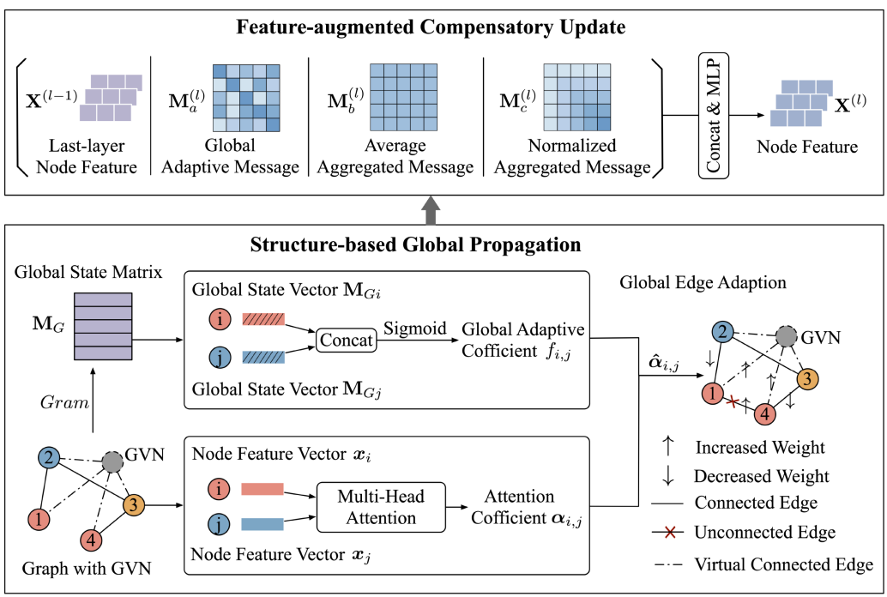

# GSF-GNN

Official implementation of [*Global structure-aware and feature-augmented graph neural network for heterophilic graphs*](https://dl.acm.org/doi/full/10.1145/3775057), published in *ACM Transactions on Information Systems*.



GSF-GNN combines structure-based global propagation with a feature-augmented compensatory update for node classification on heterophilic graphs.

## Installation

The code is implemented with PyTorch. The included `data/` directory contains 21 datasets.

```bash
git clone <YOUR_REPOSITORY_URL>
cd GSF-GNN
python -m pip install -r requirements.txt
```

## Usage

```bash
python train.py --dataset actor --device cuda --num-layers 2 --hidden-dim 64 --num-heads 8 --num-steps 200 --seed 42
```

Replace `actor` with another dataset filename in `data/` to train on it. Results are saved under `experiments/`.

## Datasets

Available values for `--dataset`:

```text
actor, amazon_ratings, chameleon, chameleon_directed,
chameleon_filtered, chameleon_filtered_directed, citeseer, cora, cornell,
minesweeper, pubmed, questions, roman_empire, squirrel, squirrel_directed,
squirrel_filtered, squirrel_filtered_directed, texas, texas_4_classes,
tolokers, wisconsin
```

## Citation

If you use this implementation, please cite the GSF-GNN paper:

```bibtex
@article{liu2025global,
  title={Global structure-aware and feature-augmented graph neural network for heterophilic graphs},
  author={Liu, Huijie and Ruan, Shulan and Liu, Qi and Cheng, Mingyue and Huang, Zhenya and Liu, Yu and Chen, Enhong and He, You},
  journal={ACM Transactions on Information Systems},
  volume={44},
  number={2},
  pages={1--28},
  year={2025},
  publisher={ACM New York, NY}
}
```
